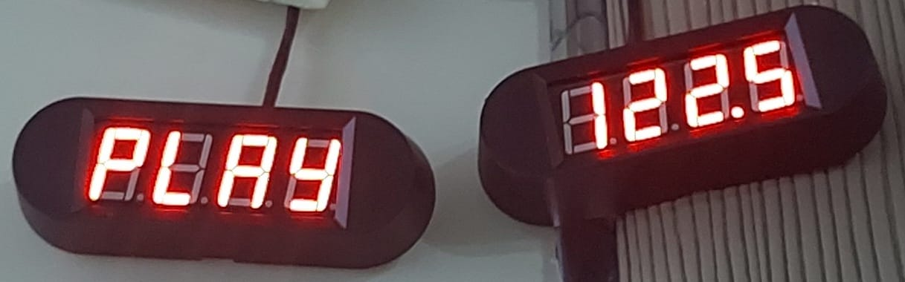

# TM1650 4 Digit 7 Seg Module Libray For Raspberry Pi v1.0

[](README_TR.md)

### By Selim Can ÖVÜR

This repository is created for public use to communicate with the TM1650 chip on 4 DIGIT 7 SEG display modules


## Downloading and setting up the library

### 1) Open the bash of raspberry pi
### 2) Simply write:

```bash
git clone https://github.com/selimsii/TM1650-4-Digit-8-Segment-Module-Raspberry-Pi.git
cd repo
```

## Technical
Targeted Architecture: Raspberry Pi Computers
Tested on: Raspberry Pi 3 B+
Language: C++
G++ Version: g++ (Debian 12.2.0-14) 12.2.0


### Explanation

1) This library provides you with a simple framework to develop your own algorithm; it is written in its simplest possible form.
2) For further development requests or possible bugs, you can open an issue.

  
## Usage

### 1) Create an instance of TM1650 class with the inputs [DT] [CLK] [BRIGHTNESS] (Brightness must be 0 - 7 max)
```C++
TM1650 display(23,24,7);
```

### 2) Initialize the instance by calling display.tm1650_init(); 
### 3) Then wrap the display(unsigned int pos,const char& symbol) and display.Terminate(); methods with try catch block

```C++
if(display.tm1650_init()){
			try {   
				display.display((argv[1][0])-48,argv[2][0]);
				display.Terminate();
			}
			catch (const GpioException& ex) {
				cerr << "Failed to connect to TM1650 chip" << endl;
				return EXIT_FAILURE;
			}
			catch (const TimeoutException& ex) {
				cerr << "Failed to connect to TM1650 chip" << endl;
				return EXIT_FAILURE;
			}	
		
	}
	else{
		cerr<<"Failed to connect to TM1650 chip";
	}
```

### Note:Do not forget to call Terminate() method after the usage
### Note 2:For the displayable list of characters,  [](https://github.com/selimsii/TM1650-4-Digit-8-Segment-Module-Raspberry-Pi/blob/master/img/Seven_seg_characthers.png)[](https://github.com/selimsii/TM1650-4-Digit-8-Segment-Module-Raspberry-Pi/blob/master/img/seven_seg_numbers.png)


