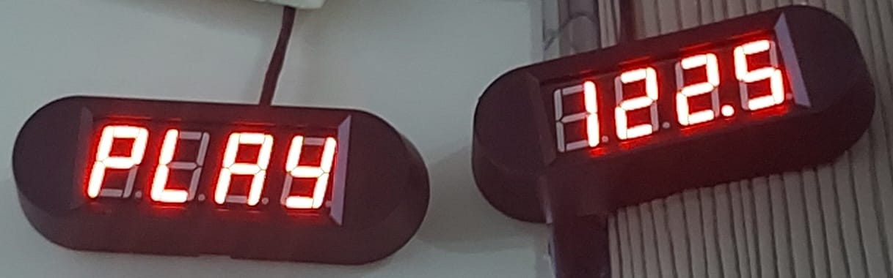

# TM1650 Raspberry Pi v1.0 için 4 Haneli 7 Seg Modül Kütüphanesi

[](README_TR.md)

### Yazan Selim Can ÖVÜR

Bu depo, 4 DIGIT 7 SEG ekran modüllerindeki TM1650 yongasıyla iletişim kurmak için genel kullanıma yönelik olarak oluşturulmuştur.


## Kitaplığı indirme ve kurma

### 1) Raspberry Pi'nin bash'ını açın
### 2) Şunu yazın:

``` bash
git clone https://github.com/selimsii/TM1650-4-Digit-8-Segment-Module-Raspberry-Pi.git
cd repo
```

## Teknik
Hedeflenen Mimari: Raspberry Pi Bilgisayarları
Test edilen cihaz: Raspberry Pi 3 B+
Dil: C++
G++ Sürümü: g++ (Debian 12.2.0-14) 12.2.0


### Açıklama

1) Bu kütüphane size kendi algoritmanızı geliştirmeniz için basit bir çerçeve sağlar; mümkün olan en basit haliyle yazılmıştır.
2) Daha fazla geliştirme talebiniz veya olası hatalar için konu açabilirsiniz.


## Kullanım

### 1) [DT] [CLK] [PARLAKLIK] girişleriyle TM1650 sınıfının bir örneğini oluşturun (Parlaklık 0 - 7 arasında olmalıdır.)
```C++
TM1650 display(23,24,7);
```

### 2) display.tm1650_init()'i çağırarak örneği başlatın;
### 3) Daha sonra display(unsigned int pos, const char& symbol) ve Terminate() fonksiyonlarını try catch blokları içerisinde çağırın.

```C++
if(display.tm1650_init()){
			try {   
				display.display((argv[1][0])-48,argv[2][0]);
				display.Terminate();
			}
			catch (const GpioException& ex) {
				cerr << "Failed to connect to TM1650 chip" << endl;
				return EXIT_FAILURE;
			}
			catch (const TimeoutException& ex) {
				cerr << "Failed to connect to TM1650 chip" << endl;
				return EXIT_FAILURE;
			}	
		
	}
	else{
		cerr<<"Failed to connect to TM1650 chip";
	}
```

### Not:Kullanımdan sonra Terminate() yöntemini çağırmayı unutmayın.
### Not 2: Görüntülenebilir karakter listesi için şunu tıklayın: [](https://github. com/selimsii/TM1650-4-Digit-8-Segment-Module-Raspberry-Pi/blob/master/img/Seven_seg_characters.png)[](https://github.com/selimsii/TM1650-4-Digit-8-Segment-Module-Raspberry-Pi/blob/master/img/seven_seg_numbers.png)